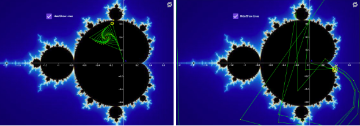
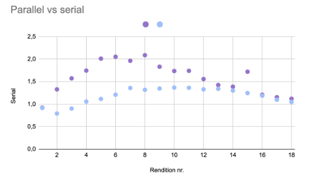

# The Mandelbrot set

The mandelbrot set is the complex numbers `C` for which a function will remain within certain boundaries without diverging to infinity when iterated. To be more precise, the equation is `zₙ₊₁ = zₙ² + C` with `z` starting at `0`. `C` is a complex number, meaning it consists of a real number and an imaginary number, which is a number multiplied by `i`, the square root of `-1`. For each `C`, the equation is iteratively computed. If the magnitude of `z` remains bounded (does not spiral to infinity), `C` is considered part of the Mandelbrot set. The behaviour of this iteration can either remain bounded or escape to infinity.

  
Here the yellow dot is a value `C` and the green dots `(z)` are the iterations of the equations. As can be seen in the left picture when iterated `Z` stays within the boundaries, and therefore `C` is in the mandelbrot set, whereas in the right picture `z` spirals off into infinity. (Pictures taken from https://www.geogebra.org/m/BUVhcRSv#material/Npd3kBKn)

If these equations are drawn out on a complex plane, a beautiful shape is formed. This image is a fractal, which means that when zooming in, instead of becoming less detailed, it continues to generate more details forever. This means you can zoom in eternally and the shape will still generate new patterns.

## Code

In my program I have created a rendition of the Mandelbrot set using C++ and SDL2. The program is made using openMP to parallelise it for quicker rendition. In addition to that, the program zooms in on a certain point in the so-called “seahorse valley” on the set, and keeps rendering new images so that the zoom in can show the fractal.

**mset**: This function determines whether a given complex number is in the Mandelbrot set. It iterates using the equation  z=z2+C  and checks if the magnitude of z exceeds a predefined threshold within a set number of iterations (max_it). It is originally set to 200 but changes dynamically depending on rendering time. If z exceeds max_it, it returns the iteration count at which this occurs, otherwise returns zero.

**renderMandelbrot**: This function is responsible for rendering the Mandelbrot set using SDL2. It transforms screen coordinates to the complex plane, calls the mset function to determine the colour of each pixel, and uses OpenMP to parallelize the rendering process. The colour is determined by the number of iterations, if it is 0 (in the set) the colour is black, otherwise the shade depends on the number of iterations before escape.

**main**: This function initialises SDL2, sets up necessary variables, and manages event handling, including zooming and quitting the program. The zoom is created to update max_it dynamically so that it can lower it when the rendering is taking a long time, and otherwise make it higher for every rendition for more detail. It repeatedly calls renderMandelbrot to update the display based on user interaction. When the mouse is clicked the zooming stops.

## Parallelisation

OpenMP retrieves the maximum number of available threads (omp_get_max_threads()) and sets this as the number of threads for computation. Typically, this number matches the number of cores on the machine, optimising parallelization.

The main parallelisation happens in the renderMandelbrot function, where there is a loop that calls another loop. Collapse(2) makes these two for-loops treated as one. This is beneficial because it ensures that the workload is evenly distributed across threads, maximising efficiency and load balancing. Schedule(dynamic) means that the work is distributed dynamically among the threads. This is advantageous because different parts of the Mandelbrot set can take varying amounts of time to compute, and dynamic scheduling allows threads to handle new tasks even as current ones are finishing.

Finally, there is an openMP critical, which means that only one thread at a time can execute this section. This is important when drawing the image because it prevents race conditions and ensures thread safety.

## Scatter plot for Parallel and Serial (18 renditions)

Scatter plot of Serial (purple) and Parallel (light blue) versions of the program.  

As seen from the scatter plot, the first set renders in about the same time for both the serial and the parallel computations (the dots overlap for rendition nr 1). The reason the first rendition is almost the same for both versions could be that there is some initial setup that takes the same amount of time to process irregardless of if the code is parallelised or not. This might include loading the SDL library, creating the window and renderer, and allocating memory.

After this however, the serial computation quickly starts to get slower, and after only a few rendations the parallel is almost twice as fast. This trend continues for a while and then they start catching up again. This is because the program is designed to change the number of max iterations depending on the rendering time, meaning the calculations in the program become simpler if the rendering takes more than 1,5 seconds. This means that after about 8 renditions, the serial program starts losing detail, while the quality of the parallel program stays the same.

## Conclusion

This program illustrates the substantial benefits of parallel computation, particularly in computationally intensive tasks like rendering fractals. The initial similarities in rendering times are explained by necessary setup steps and cache behaviours that do not benefit from parallelization. However, once the main computation starts, parallel execution outperforms serial execution significantly.

Dynamic adjustment of max_it based on rendering time helps maintain performance but introduces a trade-off with image quality. In serial computation, this leads to a reduction in detail as rendering time increases, while parallel computation maintains a higher level of detail for longer due to its efficiency in handling the computation load.

